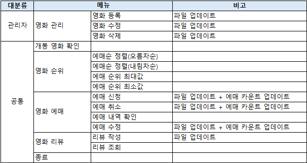

# 🎬 영화 예매 프로그램 (Movie Reservation System)

Java로 제작한 콘솔 기반 **영화 예매 시스템**입니다.  
영화 목록 조회, 예매, 예약 취소, 리뷰 작성 등 기본적인 예매 기능을 구현했습니다.  
초보자도 이해하기 쉽게 인터페이스-구현-메인 구조로 구성되어 있으며, 텍스트 파일을 기반으로 데이터를 관리합니다.

# 🎬 시연 영상 (유튜브)
  링크 - https://youtu.be/sk_KSmupRew

# 🕰️ 개발 기간

25.04.23일 - 25.04.26일
---

## 📁 프로젝트 구조

```
project1/
├── src/                      # Java 소스 코드
│   ├── MovieMain.java        # 프로그램 실행 진입점
│   ├── comparator/           # 정렬 관련 클래스
│   ├── model/                # 데이터 모델 (영화, 예약, 리뷰)
│   ├── service/              # 기능 인터페이스 및 구현
│   └── view/                 # 사용자 메뉴 화면 구성
├── res/                      # 텍스트 기반 데이터 저장소
│   ├── movieTable.txt
│   ├── reservationInfoTable.txt
│   └── reviewTable.txt
└── bin/                      # 컴파일된 클래스 파일
```

---

## 🧩 주요 기능

**사용자 및 관리자 메뉴는 다음과 같이 구성됩니다.**



### 🎛️ 관리자 기능
- 영화 등록, 수정, 삭제  
  → `movieTable.txt` 파일 실시간 업데이트  
- 개봉 영화 예매 현황 확인  
  → 예매 수 기준으로 인기 영화 파악

### 🙋 사용자 공통 기능

#### 🎞️ 영화 순위 확인
- 예매 수 정렬 (오름차순/내림차순)
- 예매 수 최대/최소 영화 조회

#### 📝 영화 예매
- 예매 신청, 취소, 내역 확인, 수정  
  → `reservationInfoTable.txt`에 정보 저장 및 예매 카운트 반영

#### ✍️ 영화 리뷰
- 리뷰 작성 및 조회  
  → `reviewTable.txt`에 저장

---

## 🚀 실행 방법

1. **자바 JDK 8 이상**이 설치되어 있어야 합니다.
2. 아래 명령어로 소스코드를 컴파일합니다:
   ```bash
   javac -d bin src/**/*.java
   ```
3. 다음 명령어로 프로그램을 실행합니다:
   ```bash
   java -cp bin MovieMain
   ```

---

## ⚙️ 설계 및 기술적 포인트

- **인터페이스 기반 구조**  
  핵심 기능은 `MovieInterface` 인터페이스로 정의하고, 실제 구현은 `MovieMaterialize` 클래스에서 담당합니다.  
  기능 구현과 실행 로직을 분리하여 유지보수성과 확장성을 높였습니다.

- **모듈화된 패키지 구조**  
  `model`, `view`, `service`, `comparator` 등 기능별로 분리된 패키지 구조를 통해 명확한 책임 분담이 가능합니다.

- **텍스트 파일 기반 데이터 저장**  
  간단한 학습용 목적에 맞게 `.txt` 파일로 데이터를 저장하며, 별도의 데이터베이스 없이 동작합니다.

- **Comparator를 이용한 정렬 기능 제공**  
  사용자 맞춤형 예매 정렬을 위해 `RsComparator` 클래스를 통해 정렬 기능을 분리 구현하였습니다.

- **콘솔 기반 UI**  
  Java 표준 입출력(Stream)을 사용하여 GUI 없이 터미널 환경에서 작동하도록 구성하였습니다.

- **입력 오류 및 예외 처리**  
  메뉴 선택, 입력 형식 오류 등에 대해 친절한 안내 메시지를 제공합니다.

---

## 🔧 핵심 클래스 설명

### ▶ 메인 및 인터페이스

| 클래스 이름        | 역할                           |
|--------------------|----------------------------------|
| `MovieMain`        | 프로그램 실행 진입점             |
| `MovieInterface`   | 핵심 기능 정의 인터페이스        |
| `MovieMaterialize` | 인터페이스 구현 클래스           |

### ▶ 메뉴 구성

| 클래스 이름    | 역할                 |
|----------------|----------------------|
| `MovieMenu`    | 사용자 메뉴 출력 및 선택 처리 |
| `AdminMenu`    | 관리자 메뉴 출력 및 선택 처리 |

### ▶ 데이터 모델

| 클래스 이름         | 역할                 |
|---------------------|----------------------|
| `MovieData`         | 영화 정보 데이터 모델 |
| `ReservationData`   | 예매 정보 데이터 모델 |
| `ReviewData`        | 리뷰 정보 데이터 모델 |

### ▶ 기타 기능

| 클래스 이름   | 역할               |
|----------------|--------------------|
| `RsComparator` | 예매 정렬 기능 제공 |

---

## 💻 사용 기술

- Java (콘솔 입출력 기반)  
- 파일 입출력 (텍스트 파일로 데이터 저장)  
- 객체 지향 설계  
- 인터페이스와 구현 분리  
- 패키지 구조화 및 모듈화

---

## 💡 참고 사항

- 모든 데이터는 `res/` 폴더에 `.txt` 형식으로 저장됩니다.  
- GUI는 지원하지 않으며, 터미널 환경에서 실행됩니다.  
- 학습 및 연습용 프로젝트입니다.

---

## 📄 라이선스

본 프로젝트는 **개인 학습 및 공유 목적**으로 작성되었습니다.  
무단 상업적 이용은 금지되어 있습니다.

---

## 🙋 기여 안내

프로젝트에 대한 피드백이나 개선 제안이 있다면 언제든지 환영입니다!  
Issue 또는 Pull Request를 열어주세요.
